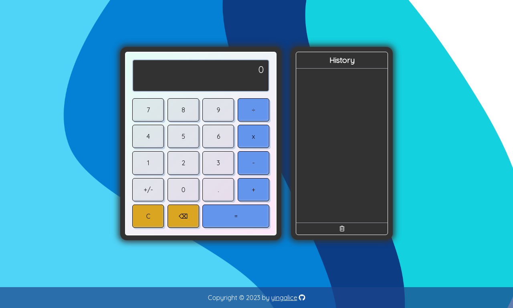
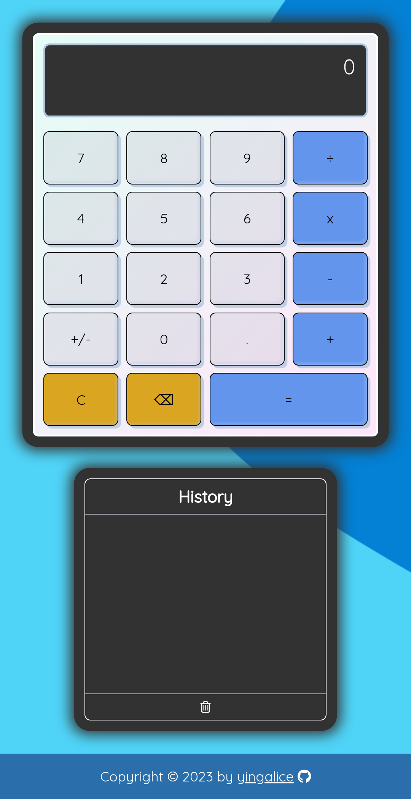

# calculator

## Live Site
- https://yingalice.github.io/calculator/

## Description
- Simple calculator with history panel
- Created for the final [project](https://www.theodinproject.com/lessons/foundations-calculator) in the Foundations course of The Odin Project curriculum
  - Per project instructions, operators are evaluated in order, one pair of numbers at a time.  There is NO order of operations.
    - Example: 12 + 7 - 5 * 3 = 42 (pressing "12 + 7 -" displays "19 -")
- Basic Features:
  - Buttons
    - Operators: Add, subtract, multiply, divide
    - Numbers: 0-9 and decimal
    - Other: positive/negative
    - Corrections: Clear, backspace
    - Equals
  - Backspace
    - General behavior: Deletes last character
    - If last button pressed was equals, show the original expression
      - Example: Backspace "7" displays "5 + 2"
    - Deletes entirety for:
      - Single digit negative number
      - Scientific notation
      - Infinity
  - Errors
    - Displayed in red
    - Operators and equals buttons disabled
  
- Bonus features:
  - History
    - Displays a history of each calculation (expression and result)
    - Select an entry to restore it
  - Formatting
    - Comma thousands separator
    - Parentheses around negative numbers in an expression
  - Calculations displayed in real time with each user input
    - Exception: Errors are hidden until user presses enter
  - Keyboard support
  - Responsive layout
    - side-by-side for desktop, top-down for mobile

## Goals
- Practice DOM manipulation, event listeners, objects, JavaScript math, CSS grid, and responsive design

## What I learned
- Dealing with floating point precision errors
  - Example: 
    - 0.1 + 0.2 = 0.30000000000000004 (expected 0.3)
  - Solution:
    -  `parseFloat(Number(input).toPrecision(15))`  Format to 15 significant digits (maximum number of "safe" digits before potentially encountering rounding errors) with `.toPrecision(15)`, and strip trailing zeros with `parseFloat()`.
- Responsive design
  - `aspect-ratio` CSS property expressed as a width / height ratio is useful for easily resizing content
- Unwanted mobile behavior
  - Disable blue tap highlight: `-webkit-tap-highlight-color: transparent`
  - Disable iOS double-tap to zoom: `touch-action: manipulation`
- Sliding animation
  - Push down effect achieved by going from 0 to full height, before finally revealing the new text
    - In JavaScript, dynamically determine the full height of each history entry element to allow for different content sizes, and set a CSS variable to animate to the desired height
- Objects
  - Get object keys or values into an array with `Object.values()` or `Object.keys()`.  Use `Object.keys(obj).length === 0` to check whether object is empty.
- Regular expressions
  - https://regexr.com/ is useful in breaking down and explaining regular expressions found online

## Image Credits
- [Calculator favicon](https://icons8.com/icon/F2XZx3KpVSbK/calculator) by [Icons8](https://icons8.com)
- [Blue background](https://pixabay.com/vectors/background-pattern-texture-modern-6230889/) by [Azheer](https://pixabay.com/users/azheer-17448000/)

## Screenshots
- Desktop  

- Mobile
